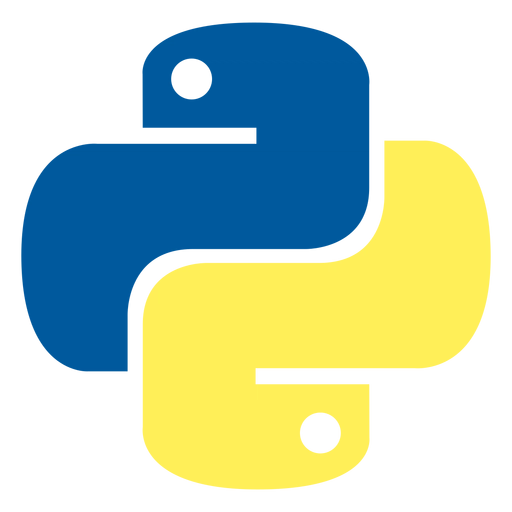

### Olá! Eu sou João Victor 👋🏻
---
Tenho formação técnica em **Desenvolvimento de Sistemas** e, ao longo da minha carreira, tenho aperfeiçoado minhas habilidades e adquirido experiência na área. Com foco, venho estudando a área de **Segurança Cibernética**, além de ter experiências durante meus estudos, trabalhando com o desenvolvimento de projetos em equipe, adquirindo conhecimentos teóricos e técnicos necessários para um desenvolvedor.

---
#### Tecnologias do meu dia a dia ☕

  
  
  
  
  
  

 

---
#### Objetivos 🎯

Ingressar na área da tecnologia, adquirindo novas conquistas em Análise e Desenvolvimento de Sistemas e Segurança Cibernética, conhecendo cada vez mais o mundo tecnologico.

